```python
#carga dos pacotes
from plotnine import *
import seaborn as sns
color = sns.color_palette()
import matplotlib.pyplot as plt
import missingno as msno

%matplotlib inline

import pandas as pd
import numpy as np
```


```python
#import da base de dados
df = pd.read_csv('arquivos/winequality.csv', sep=';')

#tipos de dados
df.dtypes
```


    type                     object
    fixed acidity           float64
    volatile acidity        float64
    citric acid             float64
    residual sugar          float64
    chlorides               float64
    free sulfur dioxide     float64
    total sulfur dioxide    float64
    density                 float64
    pH                      float64
    sulphates               float64
    alcohol                  object
    quality                   int64
    dtype: object


Podemos observar pelos tipos de dados que a informação "alcohol" que deveria conter valores entre 0 e 100 e portanto do tipo númerico está como string.
Ao tentar a conversão foi percebido que há valores não númericos na tabela, abaixo olhamos melhor esses casos:


```python
df[pd.to_numeric(df['alcohol'], errors='coerce').isnull()].shape
```


    (40, 13)


Como se tratam de apenas 40 casos, removeremos de nossa analise


```python
df = df[~pd.to_numeric(df['alcohol'], errors='coerce').isnull()]
df['alcohol'] = df['alcohol'].astype(float)
df.dtypes
```


    type                     object
    fixed acidity           float64
    volatile acidity        float64
    citric acid             float64
    residual sugar          float64
    chlorides               float64
    free sulfur dioxide     float64
    total sulfur dioxide    float64
    density                 float64
    pH                      float64
    sulphates               float64
    alcohol                 float64
    quality                   int64
    dtype: object


Agora, com todas as variáveis númericas (exceto tipo) podemos avaliar suas distribuições:


```python
df.describe()
```


<div>
<style scoped>
    .dataframe tbody tr th:only-of-type {
        vertical-align: middle;
    }

    .dataframe tbody tr th {
        vertical-align: top;
    }

    .dataframe thead th {
        text-align: right;
    }
</style>
<table border="1" class="dataframe">
  <thead>
    <tr style="text-align: right;">
      <th></th>
      <th>fixed acidity</th>
      <th>volatile acidity</th>
      <th>citric acid</th>
      <th>residual sugar</th>
      <th>chlorides</th>
      <th>free sulfur dioxide</th>
      <th>total sulfur dioxide</th>
      <th>density</th>
      <th>pH</th>
      <th>sulphates</th>
      <th>alcohol</th>
      <th>quality</th>
    </tr>
  </thead>
  <tbody>
    <tr>
      <th>count</th>
      <td>6457.000000</td>
      <td>6457.000000</td>
      <td>6457.000000</td>
      <td>6457.000000</td>
      <td>6457.000000</td>
      <td>6457.000000</td>
      <td>6457.000000</td>
      <td>6457.000000</td>
      <td>6457.000000</td>
      <td>6457.000000</td>
      <td>6457.000000</td>
      <td>6457.000000</td>
    </tr>
    <tr>
      <th>mean</th>
      <td>7.219475</td>
      <td>0.339684</td>
      <td>0.318795</td>
      <td>5.445973</td>
      <td>0.056081</td>
      <td>30.495586</td>
      <td>115.690801</td>
      <td>1.715329</td>
      <td>3.218592</td>
      <td>0.531169</td>
      <td>10.489083</td>
      <td>5.817098</td>
    </tr>
    <tr>
      <th>std</th>
      <td>1.294910</td>
      <td>0.164690</td>
      <td>0.145506</td>
      <td>4.764308</td>
      <td>0.035110</td>
      <td>17.757007</td>
      <td>56.595196</td>
      <td>7.659497</td>
      <td>0.160845</td>
      <td>0.148870</td>
      <td>1.192961</td>
      <td>0.874125</td>
    </tr>
    <tr>
      <th>min</th>
      <td>3.800000</td>
      <td>0.080000</td>
      <td>0.000000</td>
      <td>0.600000</td>
      <td>0.009000</td>
      <td>1.000000</td>
      <td>6.000000</td>
      <td>0.987110</td>
      <td>2.720000</td>
      <td>0.220000</td>
      <td>8.000000</td>
      <td>3.000000</td>
    </tr>
    <tr>
      <th>25%</th>
      <td>6.400000</td>
      <td>0.230000</td>
      <td>0.250000</td>
      <td>1.800000</td>
      <td>0.038000</td>
      <td>17.000000</td>
      <td>77.000000</td>
      <td>0.992350</td>
      <td>3.110000</td>
      <td>0.430000</td>
      <td>9.500000</td>
      <td>5.000000</td>
    </tr>
    <tr>
      <th>50%</th>
      <td>7.000000</td>
      <td>0.290000</td>
      <td>0.310000</td>
      <td>3.000000</td>
      <td>0.047000</td>
      <td>29.000000</td>
      <td>118.000000</td>
      <td>0.994900</td>
      <td>3.210000</td>
      <td>0.510000</td>
      <td>10.300000</td>
      <td>6.000000</td>
    </tr>
    <tr>
      <th>75%</th>
      <td>7.700000</td>
      <td>0.400000</td>
      <td>0.390000</td>
      <td>8.100000</td>
      <td>0.065000</td>
      <td>41.000000</td>
      <td>156.000000</td>
      <td>0.997000</td>
      <td>3.320000</td>
      <td>0.600000</td>
      <td>11.300000</td>
      <td>6.000000</td>
    </tr>
    <tr>
      <th>max</th>
      <td>15.900000</td>
      <td>1.580000</td>
      <td>1.660000</td>
      <td>65.800000</td>
      <td>0.611000</td>
      <td>289.000000</td>
      <td>440.000000</td>
      <td>103.898000</td>
      <td>4.010000</td>
      <td>2.000000</td>
      <td>14.900000</td>
      <td>9.000000</td>
    </tr>
  </tbody>
</table>
</div>


Fica nítido que a variável 'density' possui alguns outliers, o que pode ser verificado também no gráfico abaixo:


```python
sns.distplot(df['density'])
plt.show()
```


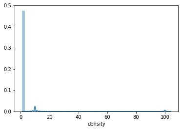


```python
df[df['density']>2]
```


<div>
<style scoped>
    .dataframe tbody tr th:only-of-type {
        vertical-align: middle;
    }

    .dataframe tbody tr th {
        vertical-align: top;
    }

    .dataframe thead th {
        text-align: right;
    }
</style>
<table border="1" class="dataframe">
  <thead>
    <tr style="text-align: right;">
      <th></th>
      <th>type</th>
      <th>fixed acidity</th>
      <th>volatile acidity</th>
      <th>citric acid</th>
      <th>residual sugar</th>
      <th>chlorides</th>
      <th>free sulfur dioxide</th>
      <th>total sulfur dioxide</th>
      <th>density</th>
      <th>pH</th>
      <th>sulphates</th>
      <th>alcohol</th>
      <th>quality</th>
    </tr>
  </thead>
  <tbody>
    <tr>
      <th>14</th>
      <td>White</td>
      <td>8.3</td>
      <td>0.42</td>
      <td>0.62</td>
      <td>19.25</td>
      <td>0.040</td>
      <td>41.0</td>
      <td>172.0</td>
      <td>10.002</td>
      <td>2.98</td>
      <td>0.67</td>
      <td>9.7</td>
      <td>5</td>
    </tr>
    <tr>
      <th>717</th>
      <td>White</td>
      <td>7.0</td>
      <td>0.27</td>
      <td>0.41</td>
      <td>18.75</td>
      <td>0.042</td>
      <td>34.0</td>
      <td>157.0</td>
      <td>10.002</td>
      <td>2.96</td>
      <td>0.50</td>
      <td>9.1</td>
      <td>5</td>
    </tr>
    <tr>
      <th>762</th>
      <td>White</td>
      <td>6.8</td>
      <td>0.24</td>
      <td>0.49</td>
      <td>19.30</td>
      <td>0.057</td>
      <td>55.0</td>
      <td>247.0</td>
      <td>100.055</td>
      <td>3.00</td>
      <td>0.56</td>
      <td>8.7</td>
      <td>5</td>
    </tr>
    <tr>
      <th>779</th>
      <td>White</td>
      <td>8.1</td>
      <td>0.17</td>
      <td>0.44</td>
      <td>14.10</td>
      <td>0.053</td>
      <td>43.0</td>
      <td>145.0</td>
      <td>10.006</td>
      <td>3.28</td>
      <td>0.75</td>
      <td>8.8</td>
      <td>8</td>
    </tr>
    <tr>
      <th>783</th>
      <td>White</td>
      <td>8.1</td>
      <td>0.17</td>
      <td>0.44</td>
      <td>14.10</td>
      <td>0.053</td>
      <td>43.0</td>
      <td>145.0</td>
      <td>10.006</td>
      <td>3.28</td>
      <td>0.75</td>
      <td>8.8</td>
      <td>8</td>
    </tr>
    <tr>
      <th>...</th>
      <td>...</td>
      <td>...</td>
      <td>...</td>
      <td>...</td>
      <td>...</td>
      <td>...</td>
      <td>...</td>
      <td>...</td>
      <td>...</td>
      <td>...</td>
      <td>...</td>
      <td>...</td>
      <td>...</td>
    </tr>
    <tr>
      <th>5787</th>
      <td>Red</td>
      <td>10.7</td>
      <td>0.90</td>
      <td>0.34</td>
      <td>6.60</td>
      <td>0.112</td>
      <td>23.0</td>
      <td>99.0</td>
      <td>100.289</td>
      <td>3.22</td>
      <td>0.68</td>
      <td>9.3</td>
      <td>5</td>
    </tr>
    <tr>
      <th>6332</th>
      <td>Red</td>
      <td>10.2</td>
      <td>0.54</td>
      <td>0.37</td>
      <td>15.40</td>
      <td>0.214</td>
      <td>55.0</td>
      <td>95.0</td>
      <td>100.369</td>
      <td>3.18</td>
      <td>0.77</td>
      <td>9.0</td>
      <td>6</td>
    </tr>
    <tr>
      <th>6333</th>
      <td>Red</td>
      <td>10.2</td>
      <td>0.54</td>
      <td>0.37</td>
      <td>15.40</td>
      <td>0.214</td>
      <td>55.0</td>
      <td>95.0</td>
      <td>100.369</td>
      <td>3.18</td>
      <td>0.77</td>
      <td>9.0</td>
      <td>6</td>
    </tr>
    <tr>
      <th>6372</th>
      <td>Red</td>
      <td>9.9</td>
      <td>0.50</td>
      <td>0.50</td>
      <td>13.80</td>
      <td>0.205</td>
      <td>48.0</td>
      <td>82.0</td>
      <td>100.242</td>
      <td>3.16</td>
      <td>0.75</td>
      <td>8.8</td>
      <td>5</td>
    </tr>
    <tr>
      <th>6374</th>
      <td>Red</td>
      <td>9.9</td>
      <td>0.50</td>
      <td>0.50</td>
      <td>13.80</td>
      <td>0.205</td>
      <td>48.0</td>
      <td>82.0</td>
      <td>100.242</td>
      <td>3.16</td>
      <td>0.75</td>
      <td>8.8</td>
      <td>5</td>
    </tr>
  </tbody>
</table>
<p>136 rows × 13 columns</p>
</div>


Para evitar viés nas analises, também removeremos os casos onde a observação possui densidade acima de 2


```python
df = df[df['density']<=2]
```

Por fim, observaremos gráficamente a distribuição de cada variável


```python
features = df.columns
features = features[1:13]
for f in features:
    sns.distplot(df[f])
    plt.show()
```


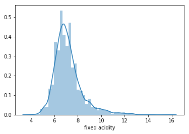


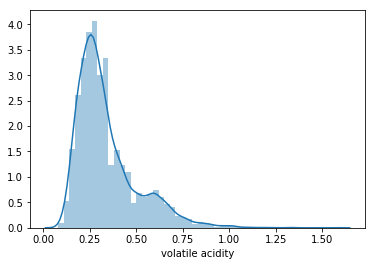


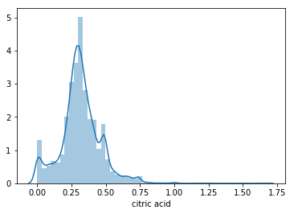


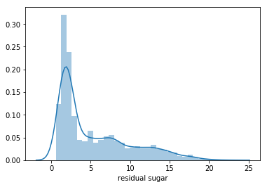


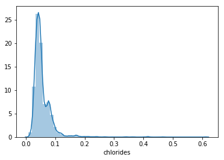


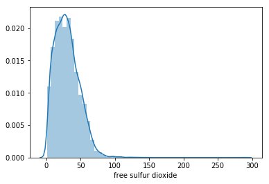


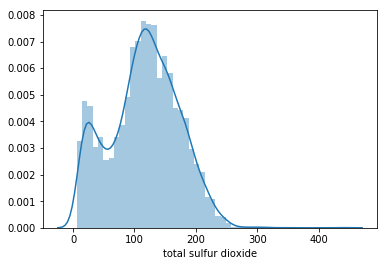


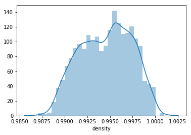


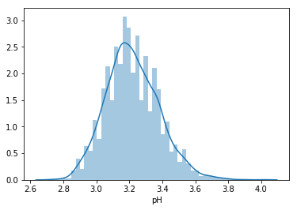


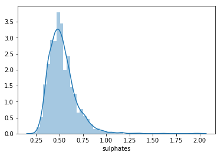


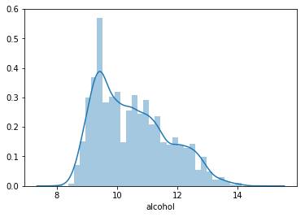


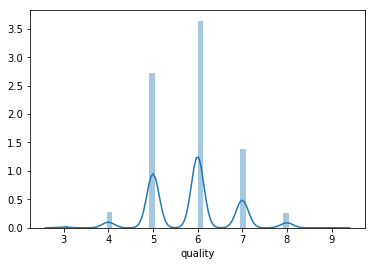


Observando a distribuição das qualificações dos vinhos, decidi que para a analise em questão usarei 3 grupos:
1. Ruim: vinhos com qualificação entre 0 e 4
2. Normal: vinhos com qualificação entre 5 e 7
3. Excelente: vinhos com qualificação entre 8 e 10


```python
bins = [0, 4, 7, 10]
labels = ['ruim','normal','excelente']
df['classificacao_qualidade'] = pd.cut(df['quality'], bins=bins, labels=labels)
df
df.drop('quality',axis =1, inplace = True)
```

Uma vez devidamente classificados podemos avaliar a relação entre as variáveis e a classificação


```python
cores = ['#f03b20', '#fec44f', '#2ca25f']
sns_plot = sns.pairplot(df, hue="classificacao_qualidade", palette=cores,diag_kind="kde")
sns_plot
```


    <seaborn.axisgrid.PairGrid at 0x7fb6f9447c18>


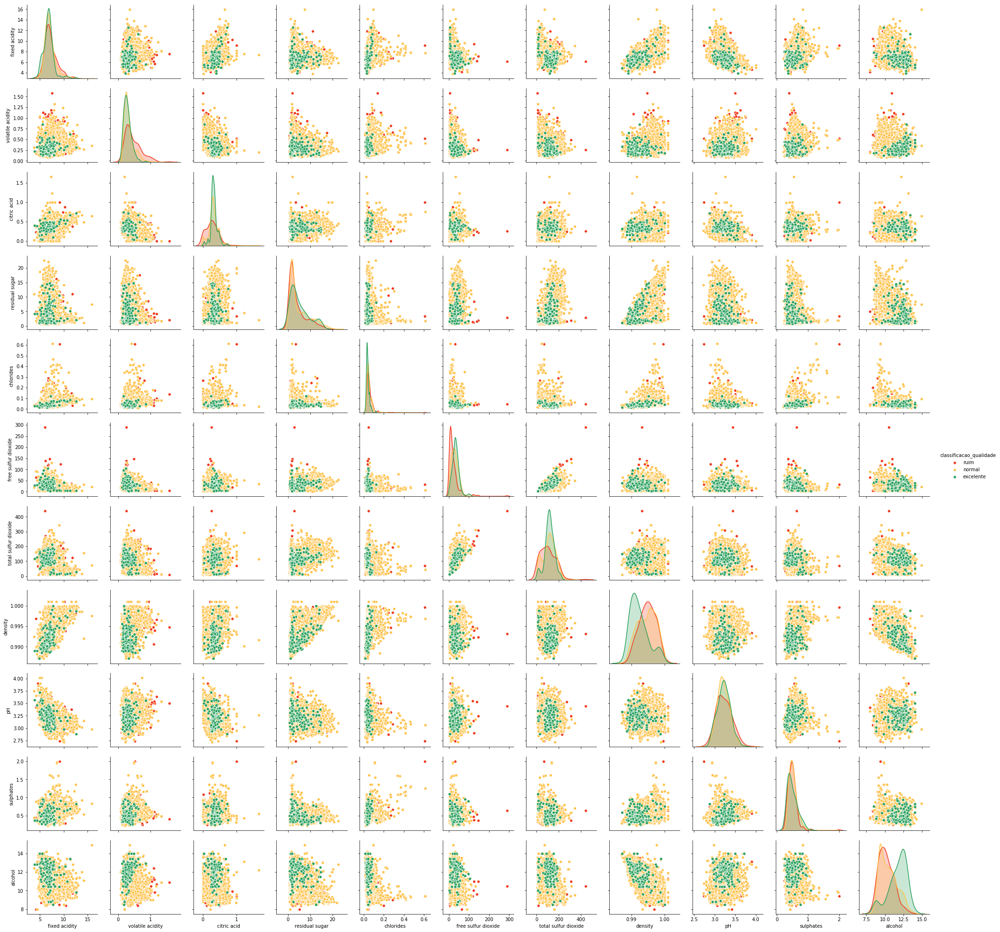


Antes de iniciarmos o processo de modelagem, checamos também a presença de valores nulos na nossa base.
Felizmente não encontramos nenhum.


```python
msno.matrix(df)
```


    <matplotlib.axes._subplots.AxesSubplot at 0x7fb6cc087cf8>


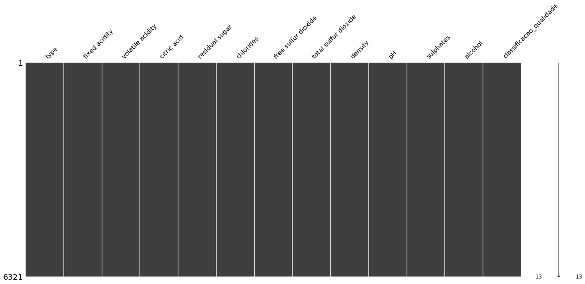


Como próximo passo pra iniciar minha modelagem, transforei a variável de tipo em uma dummy


```python
df = pd.get_dummies(df, columns=["type"], drop_first=True)
df.head()
```


<div>
<style scoped>
    .dataframe tbody tr th:only-of-type {
        vertical-align: middle;
    }

    .dataframe tbody tr th {
        vertical-align: top;
    }

    .dataframe thead th {
        text-align: right;
    }
</style>
<table border="1" class="dataframe">
  <thead>
    <tr style="text-align: right;">
      <th></th>
      <th>fixed acidity</th>
      <th>volatile acidity</th>
      <th>citric acid</th>
      <th>residual sugar</th>
      <th>chlorides</th>
      <th>free sulfur dioxide</th>
      <th>total sulfur dioxide</th>
      <th>density</th>
      <th>pH</th>
      <th>sulphates</th>
      <th>alcohol</th>
      <th>classificacao_qualidade</th>
      <th>type_White</th>
    </tr>
  </thead>
  <tbody>
    <tr>
      <th>0</th>
      <td>7.0</td>
      <td>0.27</td>
      <td>0.36</td>
      <td>20.7</td>
      <td>0.045</td>
      <td>45.0</td>
      <td>170.0</td>
      <td>1.0010</td>
      <td>3.00</td>
      <td>0.45</td>
      <td>8.8</td>
      <td>normal</td>
      <td>1</td>
    </tr>
    <tr>
      <th>1</th>
      <td>6.3</td>
      <td>0.30</td>
      <td>0.34</td>
      <td>1.6</td>
      <td>0.049</td>
      <td>14.0</td>
      <td>132.0</td>
      <td>0.9940</td>
      <td>3.30</td>
      <td>0.49</td>
      <td>9.5</td>
      <td>normal</td>
      <td>1</td>
    </tr>
    <tr>
      <th>2</th>
      <td>8.1</td>
      <td>0.28</td>
      <td>0.40</td>
      <td>6.9</td>
      <td>0.050</td>
      <td>30.0</td>
      <td>97.0</td>
      <td>0.9951</td>
      <td>3.26</td>
      <td>0.44</td>
      <td>10.1</td>
      <td>normal</td>
      <td>1</td>
    </tr>
    <tr>
      <th>3</th>
      <td>7.2</td>
      <td>0.23</td>
      <td>0.32</td>
      <td>8.5</td>
      <td>0.058</td>
      <td>47.0</td>
      <td>186.0</td>
      <td>0.9956</td>
      <td>3.19</td>
      <td>0.40</td>
      <td>9.9</td>
      <td>normal</td>
      <td>1</td>
    </tr>
    <tr>
      <th>4</th>
      <td>7.2</td>
      <td>0.23</td>
      <td>0.32</td>
      <td>8.5</td>
      <td>0.058</td>
      <td>47.0</td>
      <td>186.0</td>
      <td>0.9956</td>
      <td>3.19</td>
      <td>0.40</td>
      <td>9.9</td>
      <td>normal</td>
      <td>1</td>
    </tr>
  </tbody>
</table>
</div>


Iniciamos por fim o processo de modelagem separando nosso dataframe entre treino e teste:


```python
from sklearn.model_selection import train_test_split
X_train, X_test, y_train, y_test = train_test_split(df.drop("classificacao_qualidade",axis=1), df["classificacao_qualidade"], test_size=0.20, random_state=123)
```

Para este caso testaremos 3 modelos: SVM, RandomForest e Regressão Logística


```python
#SVM
from sklearn.svm import SVC
from sklearn.metrics import accuracy_score
svc = SVC(gamma = 0.01, C = 100, probability=True)
svc.fit(X_train, y_train)
predict_svc = svc.predict(X_test)
print(accuracy_score(y_test, predict_svc))
```

    0.9320158102766798


```python
#RF
from sklearn.ensemble import RandomForestClassifier
rf = RandomForestClassifier(n_estimators=100, 
                               bootstrap = True,
                               max_features = 'sqrt')
rf.fit(X_train, y_train)
predict_rf = rf.predict(X_test)
print(accuracy_score(y_test, predict_rf))
```

    /usr/local/lib/python3.5/site-packages/sklearn/ensemble/weight_boosting.py:29: DeprecationWarning: numpy.core.umath_tests is an internal NumPy module and should not be imported. It will be removed in a future NumPy release.
      from numpy.core.umath_tests import inner1d


    0.9454545454545454


```python
#Regressao Logistica
from sklearn.linear_model import LogisticRegression
reg_log = LogisticRegression()
reg_log.fit(X_train,y_train)
predict_reg_log = reg_log.predict(X_test)
print(accuracy_score(y_test, predict_reg_log))
```

    0.9375494071146245


Como observado o RandomForest possui uma performance melhor, porém bem próxima a Regrssão Logística e SVM.
Sendo assim, para confirmarmos nossa escolha usaremos o processo K Fold Cross-Validation


```python
from sklearn.model_selection import cross_val_score
X_train_total = df.drop("classificacao_qualidade",axis=1)
y_train_total = df["classificacao_qualidade"]

validacao_svc = cross_val_score(svc, X_train_total, y_train_total, cv=20, scoring='accuracy')
print(validacao_svc)
print('A acurácia média do SVM é de %s \n' %validacao_svc.mean())

validacao_rf = cross_val_score(rf, X_train_total, y_train_total, cv=20, scoring='accuracy')
print(validacao_rf)
print('A acurácia média do RandomForest é de %s \n' %validacao_rf.mean())

validacao_reg_log = cross_val_score(reg_log, X_train_total, y_train_total, cv=20, scoring='accuracy')
print(validacao_reg_log)
print('A acurácia média da Regressão Logística é de %s' %validacao_reg_log.mean())
```

    [0.89937107 0.88993711 0.88643533 0.88291139 0.84810127 0.88924051
     0.91772152 0.92088608 0.92088608 0.87658228 0.87974684 0.90189873
     0.89873418 0.92721519 0.88924051 0.91139241 0.92698413 0.93968254
     0.90793651 0.92063492]
    A acurácia média do SVM é de 0.9017769282297163 
    
    [0.92767296 0.92767296 0.93375394 0.92721519 0.92721519 0.93670886
     0.9335443  0.9335443  0.93670886 0.92405063 0.94303797 0.9335443
     0.93987342 0.93670886 0.94620253 0.92721519 0.94920635 0.93650794
     0.93333333 0.93333333]
    A acurácia média do RandomForest é de 0.9343525213900735 
    
    [0.92767296 0.92767296 0.93059937 0.93037975 0.93037975 0.93037975
     0.93037975 0.93037975 0.93037975 0.93037975 0.93037975 0.93037975
     0.93037975 0.9335443  0.93037975 0.92405063 0.93333333 0.93333333
     0.93650794 0.93333333]
    A acurácia média da Regressão Logística é de 0.9307112684720765


Podemos observar que apesar da pouca diferença o RandomForest apresenta melhores resultos, e portanto ele será o modelo escolhido.
Podemos aproveitar e observar qual a importância das variáveis segundo o modelo:


```python
from sklearn.metrics import confusion_matrix
# creating a confusion matrix 
cm = confusion_matrix(y_test, predict_rf) 
colunas = ["excelente","normal","ruim"]
confusion = pd.DataFrame(cm, index=colunas, columns=colunas)
confusion
```


<div>
<style scoped>
    .dataframe tbody tr th:only-of-type {
        vertical-align: middle;
    }

    .dataframe tbody tr th {
        vertical-align: top;
    }

    .dataframe thead th {
        text-align: right;
    }
</style>
<table border="1" class="dataframe">
  <thead>
    <tr style="text-align: right;">
      <th></th>
      <th>excelente</th>
      <th>normal</th>
      <th>ruim</th>
    </tr>
  </thead>
  <tbody>
    <tr>
      <th>excelente</th>
      <td>11</td>
      <td>26</td>
      <td>0</td>
    </tr>
    <tr>
      <th>normal</th>
      <td>1</td>
      <td>1181</td>
      <td>5</td>
    </tr>
    <tr>
      <th>ruim</th>
      <td>0</td>
      <td>37</td>
      <td>4</td>
    </tr>
  </tbody>
</table>
</div>


Apesar dos ótimos resultados gerais na classificação dos vinhos, nossa acurácia para os vinhos tidos como "ruins ou excelente" se mostra baixa... isso devido trabalharmos com uma base não equilibrada, onde a grande concentração está na clase "normal".
